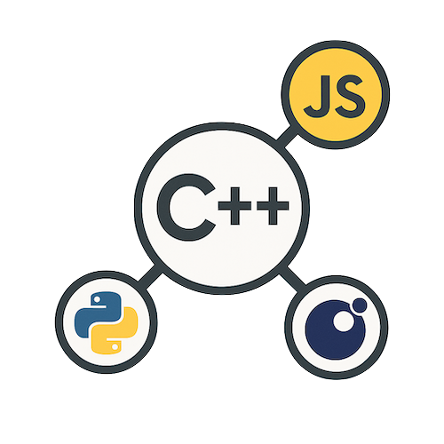

# Rosetta, a C++ automatic language binding

<p align="center">
  
</p>

<p align="center">
  
  
  
</p>

<p align="center">
  
  
</p>

<br><br>
## Actually working on non intrusif introspection (no inheritance, no wrapper, nothing)!
### Keep connected on this page...
<br><br>

A lightweight, headers-only C++ introspection system that enables runtime inspection and manipulation of class members and methods without external dependencies.

*This C++ introspection system enables automatic language binding generation for multiple scripting languages—eliminating both (1) the need for manual binding code for each class member and method, and (2) the need for any knowledge of the underlying binding libraries*:

1. 👉 Min effort
2. 👉 Just a few lines of C++ are needed
3. 👉 Automatic language binding
4. 👉 All supported scripting languages shared a same API
5. 👉 C++ API changes? Just recompile for all scripting languages 🚀

Example for some well known scripting languages:

- **Python**, the introspection data can drive automatic pybind11 binding generation, creating properties for all members and properly typed method bindings with argument validation - eliminating the need to manually write .def() calls for each class feature. Example:
  ```cpp
  PYBIND11_MODULE(introspection_demo, m) {
      rosetta::PyGenerator(m).bind_classes<Person, Vehicle>();
  }
  ```

- **JavaScript** (via V8, Node.js addons, or Emscripten), the reflection data enables automatic generation of property descriptors and method wrappers, allowing seamless integration where JavaScript objects can directly access C++ class members as properties and call methods with automatic type conversion between JavaScript values and C++ types. Example:
  ```cpp
  Napi::Object Init(Napi::Env env, Napi::Object exports) {
      rosetta::JsGenerator(env, exports).bind_classes<Person, Vehicle>();
      return exports;
  }
  ```

- **Lua** (via Lua or LuaGit, and Sol3), the type information allows automatic creation of Lua userdata metatables with `__index` and `__newindex` metamethods that dynamically resolve member access, while method calls can be automatically wrapped using the stored function signatures and parameter types. Example:
  ```cpp
  void main() {
    sol::state lua;
    lua.open_libraries(sol::lib::base);    
    // Bind classes automatically
    rosetta::LuaGenerator(lua).bind_classes<Person, Vehicle>();
  }
  ```


## Comparison: Lua vs Python vs JavaScript

| Feature         | Lua            | Python               | JavaScript       |
| --------------- | -------------- | -------------------- | ---------------- |
| Binding Library | Sol3           | pybind11             | N-API            |
| Setup Lines     | 1              | 1                    | 1                |
| Performance     | Fastest        | Fast                 | Fast             |
| Use Case        | Game scripting | Scientific computing | Web/Desktop apps |

The key advantage is that once a C++ class inherits from Introspectable and registers its members/methods, it can be automatically exposed to all scripting languages using the same introspection metadata, drastically reducing the maintenance burden of keeping multiple language bindings synchronized with C++ class changes.

## Features

- **Runtime Member Access**: Get/set member variables by name
- **Runtime Method Invocation**: Call methods by name with parameters
- **Type-Safe**: Compile-time registration with runtime type checking
- **Template-Based**: Clean, fluent registration API using member/method pointers
- **Zero Dependencies**: No external libraries required
- **C++20 Compatible**: Uses modern C++ features like `std::any` and `if constexpr`
- **Multiple constructors** if **needed**
- **std::vector** support: see [this example](./examples/javascript/vector)
- **std::array** support: see [this example](./examples/javascript/array)
- **Functor** support (C++ → Script) and (Script → C++): see [this example](./examples/javascript/functors)
- **Pointer handling**: see [this example](./examples/javascript/classes)
- **Standalone functions**: see [this example](./examples/javascript/functions)

## Quick Start

### 1. Make Your Class Introspectable (or wrap it)

```cpp
#include <rosetta/rosetta.h>

class Person : public rosetta::Introspectable {
    INTROSPECTABLE(Person)    
public:
    Person(const std::string& n, int a) : name(n), age(a) {}
    
    std::string getName() const { return name; }
    void setName(const std::string& n) { name = n; }
    int getAge() const { return age; }
    void introduce() { std::cout << "Hi, I'm " << name << std::endl; }

private:
    std::string name;
    int age;
};
```

### 2. Register Ctors, Members and Methods

```cpp
void Person::registerIntrospection(rosetta::TypeRegistrar<Person> reg) {
    reg.constructor<>()
       .constructor<const std::string&, int, double>()
       .member("name", &Person::name)
       .member("age", &Person::age)
       .method("getName", &Person::getName)
       .method("setName", &Person::setName)
       .method("getAge", &Person::getAge)
       .method("introduce", &Person::introduce);
}
```

### 3. Bind in JavaScript (1 line)

```cpp
#include <rosetta/generators/js.h>

Napi::Object Init(Napi::Env env, Napi::Object exports) {
    rosetta::JsGenerator(env, exports).bind_class<Person>();
    return exports;
}

NODE_API_MODULE(jsperson, Init)
```

### 4. Bind in Python (1 line)

```cpp
#include <rosetta/generators/py.h>

PYBIND11_MODULE(rosettapy, m) {
    rosetta::PyGenerator(m).bind_class<Person>();
}
```

### 5. Bind in Lua (1 line)

```cpp
#include <rosetta/generators/lua.h>

void main() {
    ...
    rosetta::LuaGenerator(lua).bind_class<Person>();
}
```

## Limitations

- Requires explicit registration of members/methods
- Runtime overhead due to `std::any` and function pointers
- No inheritance introspection (each class registers independently)

## License

LGPL License - feel free to use in your project

## Author
[xaliphostes](https://github.com/xaliphostes)
